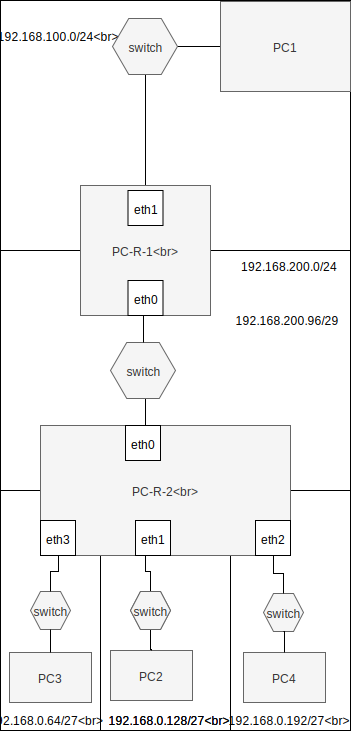

System operacyjny w środowisku sieciowym
=========================================

Charakterystyka systemu operacyjnego
------------------------------------

| Charakterystyka | wartość           | komentarzu |
| ------------- |:-------------:| -----:|
| nazwa      | linux | centos 7 |
| program (parametry sieci)      | nie wiem |  |

Konfiguracja połączenia sieciowego
----------------------------------

| Parametr | wartość           | komentarzu |
| ------------- |:-------------:| -----:|
| Adres IP      | 10.0.2.15 | przydzielony przez DHCP |
| Maska podsieci      | 24 |  |
| Brama      | 10.0.2.2 |  |
| DNS 1      | 10.10.0.8 |  |
| DNS 2      | 10.10.0.4 |  |

Schemat sieci
-------------

Ustawianie parametrów sieci ip
------------------------------

* stan interfejsu
    * interfejs up
    * interfejs down
* adresacja
    * dodaj adres
    * zmień adres
    * usuń adres
* routing
    * dodaj trasę default
    * dodaj trasę przez bramę
    * dodaj trasę przez interfejs
    * usuń trasę
    * zmień trasę
    * pobierz trasę dla adresu
* adresacja fizyczna
    * pokaż adresy interfejsów dostępnych w sieci
    * pokaż adresy dla konkretnego interfejsu
     

podstawowe komendy 
-------------------------
|  polecenie   | opis  |
| -------------| :-----|
| ifup <nazwa>  |  Do wlaczenia karty | 
| ifup <nazwa>  |  Do wylaczenia karty | 
| nmcli device show | Nazwa karty |

ip 
-------------------------
| subcommand    |  polecenie   | opis  |
| ------------- |:-------------| :---------------| 
|   ``addr``    |                               | infirmacje o adresacji i własnościach interfejsów |
|               |   ``ip addr``                 | informacja o wszystkich interfejsach              |
|               |   ``ip addr show dev enp0s3`` | informacja o konkretnym interfejsie               |
|   ``link``    |   ``ip link set enp0s3 down`` | wyłącza interfejs enp0s3                          |
|               |   ``ip link set enp0s3 up``   | włącza interfejs enp0s3                           |
|   ``route``   |   ``ip route show ``          | pokazuje wszystkie routy                          |
|               |   ``ip route add``            | dodaje do tablicy routing np: ``ip route add default via 10.0.10.1 dev enp0s3``|
|               |   ``ip route get``            | sprawdzenie gdzie konkretny adres zostanie wysłany np: ``ip route get 8.8.8.8`` |
|   ``maddr``   |               |  |
|   ``neigh``   |  | |
|   ``help``    |  | |

Zadanie
------------

## Komentarz
po wypełnieniu poleceń otrzymałem następującą sytuację:
wykonanie komendy ping w pc1 i pc3 tak aby widziały pc0 przebiegało pomyślnie 
pc0 dla komendy ping poprawnie pokazywało wynik tylko dla routa który był ustawiony na default 
dla tego drugiego komunikat brzmiał 'Destination Host Unreachable' 
czy to poprawne zachowanie? jeśli tak to dlaczego? 
pc1 i pc3 nie widziały się wzajemnie 

Podsieci i nadsieci IP
----------------------

adresacja
-----------------------------------------------------
| PC     |  interfejs   | adres  |
| --------- |:-------------| :---------------| 
| ``PC1``   | enp0s3 | 192.168.100.10/24     |
| ``PC-R-1``| enp0s3 | 192.168.100.1/24      |
| ``PC-R-1``| enp0s8 | 192.168.200.1/24      |
| ``PC-R-2``| enp0s3 | 192.168.200.2/24      |
| ``PC-R-2``| enp0s8  | 192.168.0.1/24       |
| ``PC-R-2``| enp0s9  |      |
| ``PC-R-2``| enp0s10 |      |
| ``PC2``   | enp0s3  | 192.168.0.22/24      |

routing
-------

| destination | trasa | interfejs  |
| --------- |:-------------| :---------------| 
| ``PC1``     |  | |
| ``default`` | 192.168.100.1 | enp0s3 ``ip route add default via 192.168.100.1`` |
| ``PC-R-1``  |  |        |
| ``192.168.100.0/24`` | 192.168.100.1 | enp0s3 |
| ``192.168.200.0/24`` | 192.168.200.1 | enp0s8 |
| mozna dzielic   |  |  |
| ``192.168.0.64/27``  | 192.168.200.2 | enp0s8 |
| ``192.168.0.128/27`` | 192.168.200.2 | enp0s8 |
| ``192.168.0.192/27`` | 192.168.200.2 | enp0s8 |
| lub za 1 zamachem   |  |  |
| ``192.168.0.0/24``   | 192.168.200.2 | enp0s8 |
| ``PC-R-2``  |  |        |
| ``192.168.200.0/24`` | 192.168.200.2 | enp0s3 |
| ``192.168.100.0/24`` | 192.168.200.1 | enp0s3 |
| ``192.168.0.64/27``  | 192.168.0.65  | enp0s8 |
| ``192.168.0.128/27`` | 192.168.0.129 | enp0s9 |
| ``192.168.0.192/27`` | 192.168.0.193 | enp0s10 |

Zadanie
------------

1.
   * Przygotuj konfigurację sieci zgodnie z powyższym diagramem
   * W pierwszej kolejności przygotuj ``PC1``, ``PC-R-1``, ``PC-R-2``, ``PC-2``
   * Do konfiguracji wykorzystaj dane z tabeli powyżej
   * Rozszerz istniejącą konfigurację dzieląc istnijącą sieć dla ``PC2`` na 3 podsieci zgodnie z diagramem
   * Przetestuj połączenie pomiędzy wszystkimi elementami sieci ``PC1->PC2`` ``PC1->PC4``
   * Zapewnij permanentną konfigurację, dodając odpowiednie wpisy w plikach konfiguracji

Zadanie do domu
---------------

1. Wykorzystując program dia oraz ikony CISCO
  * Przygotuj diagram powyższej sieci uwzględniając urządzenia tj:
    * ROUTER
    * SWITCH
    * PC
  * Uzupełnij diagram o adresację sieci oraz poszczególnych urządzeń
  
