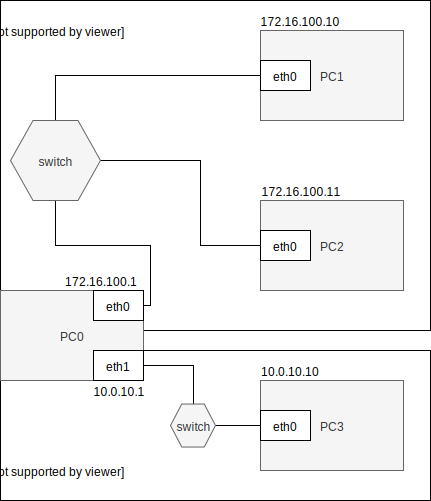

System operacyjny w środowisku sieciowym
=========================================

Charakterystyka systemu operacyjnego
------------------------------------

| Charakterystyka | wartość           | komentarzu |
| ------------- |:-------------:| -----:|
| nazwa      | linux | centos 7 |
| program (parametry sieci)      | nie wiem |  |

Konfiguracja połączenia sieciowego
----------------------------------

| Parametr | wartość           | komentarzu |
| ------------- |:-------------:| -----:|
| Adres IP      | 10.0.2.15 | przydzielony przez DHCP |
| Maska podsieci      | 24 |  |
| Brama      | 10.0.2.2 |  |
| DNS 1      | 10.10.0.8 |  |
| DNS 2      | 10.10.0.4 |  |

Schemat sieci
-------------

Ustawianie parametrów sieci ip
------------------------------

* stan interfejsu
    * interfejs up
    * interfejs down
* adresacja
    * dodaj adres
    * zmień adres
    * usuń adres
* routing
    * dodaj trasę default
    * dodaj trasę przez bramę
    * dodaj trasę przez interfejs
    * usuń trasę
    * zmień trasę
    * pobierz trasę dla adresu
* adresacja fizyczna
    * pokaż adresy interfejsów dostępnych w sieci
    * pokaż adresy dla konkretnego interfejsu
     

podstawowe komendy 
-------------------------
|  polecenie   | opis  |
| -------------| :-----|
| ifup <nazwa>  |  Do wlaczenia karty | 
| ifup <nazwa>  |  Do wylaczenia karty | 
| nmcli device show | Nazwa karty |

ip 
-------------------------
| subcommand    |  polecenie   | opis  |
| ------------- |:-------------| :---------------| 
|   ``addr``    |                               | infirmacje o adresacji i własnościach interfejsów |
|               |   ``ip addr``                 | informacja o wszystkich interfejsach              |
|               |   ``ip addr show dev enp0s3`` | informacja o konkretnym interfejsie               |
|   ``link``    |   ``ip link set enp0s3 down`` | wyłącza interfejs enp0s3                          |
|               |   ``ip link set enp0s3 up``   | włącza interfejs enp0s3                           |
|   ``route``   |   ``ip route show ``          | pokazuje wszystkie routy                          |
|               |   ``ip route add``            | dodaje do tablicy routing np: ``ip route add default via 10.0.10.1 dev enp0s3``|
|   ``maddr``   |   ``ip route get``            | sprawdzenie gdzie konkretny adres zostanie wysłany np: ``ip route get 8.8.8.8`` |
|   ``neigh``   |  | |
|   ``help``    |  | |

Zadanie
------------

