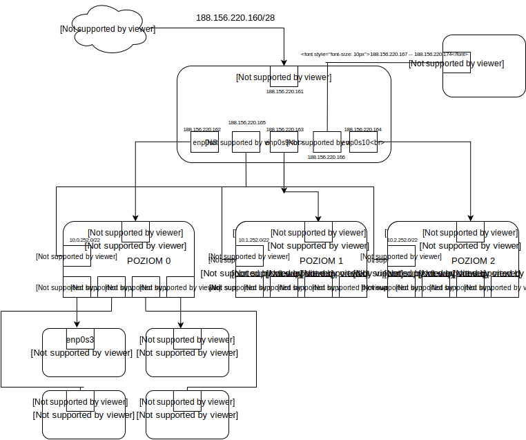

## Zadanie 12

Tablica routingu na przykładzie poziomu 0:

| sieć    |  destination   | gateway  |
| ------------- |:-------------| :---------------| 
|   10.0.9.0/26    |   default | 10.0.0.0 |
|   10.0.13.0/26   |   default | 10.0.0.0 |
|   10.0.14.0/26   |   default | 10.0.0.0 |
|   10.0.17.0/26   |   default | 10.0.0.0 |
|   10.0.252.0/22  |   default | 188.156.220.165|
|                  |   10.0.0.0| 188.156.220.162|
|                  |   188.156.220.162 | 188.156.220.161|

Pozostałe piętra analogicznie, każde laboratorium do routera na piętrze, a ten do serwerowni
