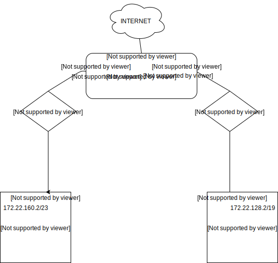

#### Zaprojektuj oraz przygotuj prototyp rozwiązania z wykorzystaniem oprogramowania VirtualBox lub podobnego. Zaproponuj rozwiązanie spełniające poniższe wymagania:
- Usługodawca zapewnia domunikację z siecią internet poprzez interfejs eth0 PC0
- Zapewnij komunikację z siecią internet na poziomie LAN1 oraz LAN2
- Dokonaj takiego podziału sieci o adresie 172.22.128.0/17 aby w LAN1 można było zaadresować 500 adresów natomiast w LAN2 5000 adresów
- Przygotuj dokumentację powyższej architektury w formie graficznej w programie DIA

Rozwiązanie:

### Podjęte kroki
Do podziału była sieć o adresie ``172.22.128.0/17``. Aby LAN2 miało >5000 adresów należy mu przydzielić adres ``172.22.128.0/17``.
Następny wolny adres, który może zostać użyty w LAN1 to 172.22.160.0/23. Maska sieci w notacji CIDR równa 23 zapewnia wymagane min. 500 adresów.

Uwzględniając interfejsy poszczególnych jednostek, całość będzie wyglądała następująco: 

| Nazwa | Interfejs           | Adres |
| ------------- |:-------------:| -----:|
| PC0      | enp0s3 | 10.0.2.15/24 |
|       | enp0s9 | 172.22.128.1/19 |
|       | enp0s8 | 172.22.160.1/23 |
| PC1 | enp0s3 | 172.22.160.2/23 |
| PC2 | enp0s3 | 172.22.128.2/19 |

Jeśli chodzi o routing to dla PC1 oraz PC2 wygląda następująco:

| Nazwa | destination  | gateway |
| ------------- |:-------------:| -----:|
| PC1 | default | 172.22.160.1/23 |
| PC2 | default | 172.22.128.1/19 |

## KONFIGURACJA NA VB
#### Ogólne
1. Tworzę 3 obrazy	
2. W ustawieniach globalnych dodaje dwie sieci NAT:	
      1) 172.22.160.0/23 - dla 500 hostów	
      2) 172.22.128.0/19 - dla 5000 hostów	
      Ważne żeby wyłączyć DHCP	
3. W ustawieniach poszczególnych obrazów dodaje sieci NAT pamiętając że PC0 ma mieć dostęp do internetu	

#### PC0
Do pliku ``/etc/network/interfaces`` dodaję interfejsy tj.:  
``auto enp0s8``  
``iface enp0s8 inet static``  
``address 172.22.160.1``  
``netmask 255.255.254.0``  
  
``auto enp0s9``  
``iface enp0s9 inet static``  
``address 172.22.128.1``  
``netmask 255.255.224.0``  

Następnie włączam forwardowanie pakietów komendą ``echo 1 > /proc/sys/net/ipv4/ip_forward``
oraz modyfikuję plik ``/etc/sysctl.d/99-sysctl.conf`` usuwając komentarz przy linijce ``net.ipv4.ip_forward=1`` aby forwardowanie plików 
było włączone na stałe

#### PC1
Modyfikuję ``/etc/network/interfaces`` aby dodać interfejs oraz zdefiniować defaultowy routing  
``auto enp0s3``  
``iface enp0s3 inet static``  
``address 172.22.160.2``  
``netmask 255.255.254.0``  
``up ip route add default via 172.22.160.1``  

#### PC2
Modyfikuję ``/etc/network/interfaces`` aby dodać interfejs oraz zdefiniować defaultowy routing  
``auto enp0s3``  
``iface enp0s3 inet static``  
``address 172.22.128.2``  
``netmask 255.255.224.0``  
``up ip route add default via 172.22.128.1``  

### PC0
Dodaję reguły masquerade komendami:  
``iptables -t nat -A POSTROUTING -s 172.22.128.0/23 -o enp0s3 -j MASQUERADE``
``iptables -t nat -A POSTROUTING -s 172.22.160.0/19 -o enp0s3 -j MASQUERADE``
Zapisuję:  
``ipatables-save > /etc/iptables.up.rules``
Oraz dopisuję linijkę ``post-up iptables-restore < /etc/iptables.up.rules`` w ``/etc/network/interfaces`` aby po starcie systemu
reguły zostały wczytane.

### PC1 i PC2
Aby zapewnić internet w PC1 i PC2 dodaję adres dns komendą
``echo 'nameserver 1.1.1.1' > /etc/resolv.conf``

Całość powinna w tym momencie sprawnie funkcjonować. PC1 i PC2 powinny widzieć się na wzajem oraz oba powinny mieć połączenie z internetem

