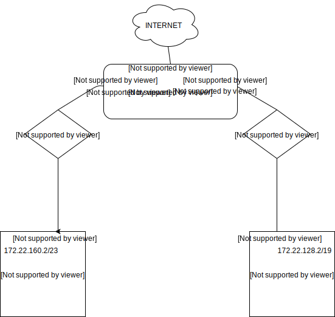

#### Zaprojektuj oraz przygotuj prototyp rozwiązania z wykorzystaniem oprogramowania VirtualBox lub podobnego. Zaproponuj rozwiązanie spełniające poniższe wymagania:
- Usługodawca zapewnia domunikację z siecią internet poprzez interfejs eth0 PC0
- Zapewnij komunikację z siecią internet na poziomie LAN1 oraz LAN2
- Dokonaj takiego podziału sieci o adresie 172.22.128.0/17 aby w LAN1 można było zaadresować 500 adresów natomiast w LAN2 5000 adresów
- Przygotuj dokumentację powyższej architektury w formie graficznej w programie DIA

Rozwiązanie:

### Podjęte kroki
Do podziału była sieć o adresie ``172.22.128.0/17``. Aby LAN2 miało >5000 adresów należy mu przydzielić adres ``172.22.128.0/17``.
Następny wolny adres, który może zostać użyty w LAN1 to 172.22.160.0/23. Maska sieci w notacji CIDR równa 23 zapewnia wymagane min. 500 adresów.

Uwzględniając interfejsy poszczególnych jednostek, całość będzie wyglądała następująco: 

| Nazwa | Interfejs           | Adres |
| ------------- |:-------------:| -----:|
| PC0      | enp0s3 | 10.0.2.15/24 |
|       | enp0s9 | 172.22.128.1/19 |
|       | enp0s8 | 172.22.160.1/23 |
| PC1 | enp0s3 | 172.22.160.2/23 |
| PC2 | enp0s3 | 172.22.128.2/19 |

Jeśli chodzi o routing to dla PC1 oraz PC2 wygląda następująco:

| Nazwa | destination  | gateway |
| ------------- |:-------------:| -----:|
| PC1 | default | 172.22.160.1/23 |
| PC2 | default | 172.22.128.1/19 |

## KONFIGURACJA NA VB
#### Ogólne
1. Tworzę 3 obrazy	
2. W ustawieniach globalnych dodaje dwie sieci NAT:	
      1) 172.22.160.0/23 - dla 500 hostów	
      2) 172.22.128.0/19 - dla 5000 hostów	
      Ważne żeby wyłączyć DHCP	
3. W ustawieniach poszczególnych obrazów dodaje sieci NAT pamiętając że PC0 ma mieć dostęp do internetu	

#### PC0
Do pliku ``/etc/network/interfaces`` dodaję interfejsy tj.:
``auto enp0s8``
``iface enp0s8 inet static address 172.22.160.1``
``netmask 255.255.254.0``

``auto enp0s8``
``iface enp0s8 inet static address 172.22.160.1``
``netmask 255.255.254.0``

